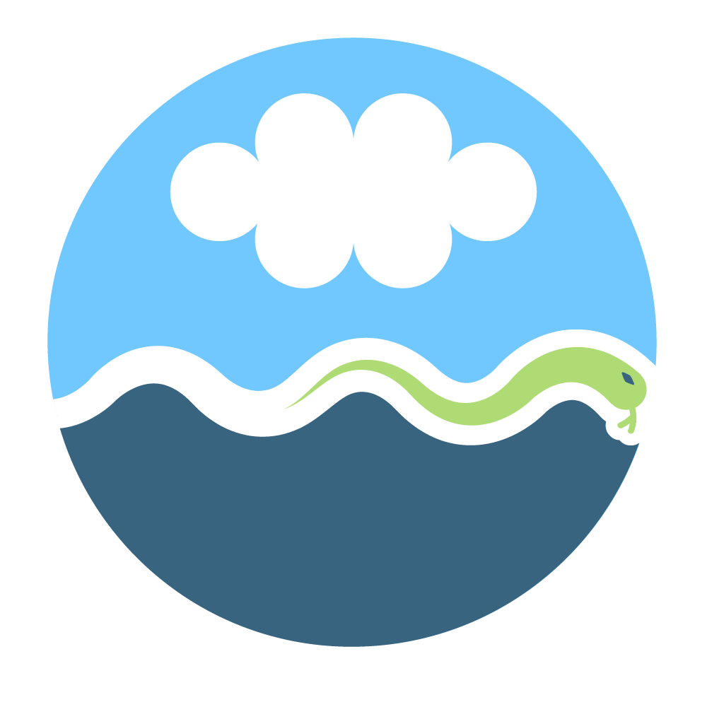

.. aospy documentation master file, created by
   sphinx-quickstart on Wed Oct 12 16:24:08 2016.
   You can adapt this file completely to your liking, but it should at least
   contain the root `toctree` directive.

.. _main-page:

#####################################################
aospy: automated climate data analysis and management
#####################################################

**aospy** (pronounced A - O - S - py) is an open source Python package
for automating your computations that use gridded climate and weather
data (namely data stored as netCDF files) and the management of the
results of those computations.

aospy enables firing off multiple calculations in parallel using the
permutation of an arbitrary number of climate models, simulations,
variables to be computed, date ranges, sub-annual-sampling, and many
other parameters.  In other words, it is possible using aospy to
submit and execute *all* calculations for a particular project
(e.g. paper, class project, or thesis chapter) with a single command!

The results get saved in a highly organized directory tree as netCDF
files, making it easy to subsequently find and use the data (e.g. for
plotting) and preventing "orphan" files with vague filenames and
insufficient metadata to remember what they are and/or how they were
computed.

The eventual goal is for aospy to become the community standard for
gridded climate data analysis and, in so doing, accelerate progress in
climate science and make the results of climate research more easily
reproducible and shareable.

Documentation
=============
.. toctree::
   :maxdepth: 1

   whats-new
   overview
   using-aospy
   examples
   install
   api

See also
========

- Spencer Hill's talk on aospy (`slides`_, `recorded talk`_) at the
  Seventh Symposium on Advances in Modeling and Analysis Using Python,
  recorded 2017 January 24 as part of the 2017 American Meteorological
  Society Annual Meeting.
- Our `guest post`_, "What's needed for the future of AOS python?
  Tools for automating AOS data analysis and management" on the
  `PyAOS`_ blog.
- Our shout-out in Katy Huff's PyCon 2017 `keynote talk`_ (scroll to
  23:35 for the bit about us)
- The `xarray`_ package, upon which aospy relies heavily.

.. _slides: https://ams.confex.com/ams/97Annual/webprogram/Handout/Paper310912/2017-01-24ams-aospy.pdf
.. _recorded talk: https://ams.confex.com/ams/97Annual/recordingredirect.cgi/id/37391?entry_password=660615&uniqueid=Paper310912
.. _guest post: http://pyaos.johnny-lin.com/?p=1546
.. _PyAOS: http://pyaos.johnny-lin.com/
.. _keynote talk: https://www.youtube.com/watch?v=kaGS4YXwciQ
.. _xarray:  http://xarray.pydata.org

Get in touch
============

- Troubleshooting: We are actively seeking new users and are eager to
  help you get started with aospy!  Usage questions, bug reports, and
  any other correspondence are all welcome and best placed as `Issues
  <https://github.com/spencerahill/aospy/issues>`_ on our `Github repo
  <https://github.com/spencerahill/aospy>`_.
- Our `mailing list`_: join it!  Questions, bug reports, and comments
  are welcome there also.
- Contributing: We are also actively seeking new developers!  Please
  get in touch by opening an Issue or submitting a Pull Request.

.. _mailing list: https://groups.google.com/d/forum/aospy

License
=======

aospy is freely available under the open source `Apache License
<http://www.apache.org/licenses/>`_.

History
=======

aospy was originally created by Spencer Hill as a means of automating
calculations required for his Ph.D. work across many climate models
and simulations.  Starting in 2014, Spencer Clark became aospy's
second user and developer.  The first official release on PyPI was
v0.1 on January 24, 2017.
